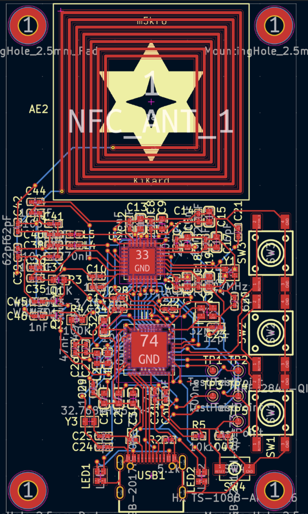
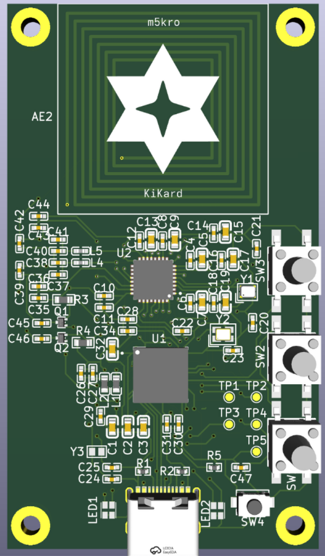

# KiKard-old
KiKard is a non working attempt at creating an NFC testing device. This repo is just here as an example for what not to do. 
 
There will be a v2 of the project where I fix my mistakes, lower the costs, and make some general improvements. 
 
Here's a medium article explaining what went wrong: [Here](https://medium.com/the-first-digit/challenges-of-designing-hardware-910d764eaf81)

# Images
Here's what it looks like: 

